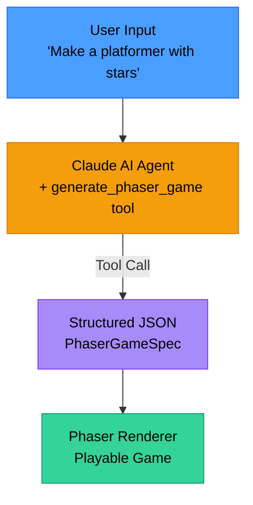

# Pueo

<picture>
  <source media="(prefers-color-scheme: dark)" width="200" height="200" srcset="./public/pueo-dark.png">
  <source media="(prefers-color-scheme: light)" width="200" height="200" srcset="./public/pueo.png">
  
</picture>


Named after the owl endemic to Hawaii, Pueo is an AI-powered game builder that helps you create browser-based games through natural conversation. Built with [Tauri](https://v2.tauri.app/), React, and Claude AI.

## Features

- Describe your game idea in natural language and Claude generates it using structured JSON.
- Games use expressive emojis (🚀, 👾, ⭐) for characters and objects with precise physics-based collision detection.
- Games render in real-time using the Phaser 3 game engine.
- Browse, search, play, and manage your saved games in a built-in library.
- Claude uses tool calling to create precise, validated game specifications.
- All games are saved locally to a SQLite database with version history.
- Rich game mechanics including physics, controls, AI behaviors, spawning systems, and actions.

## Quick Start

### Prerequisites

- Node.js 18+ and npm
- Rust (for Tauri)
- Anthropic API key ([get one here](https://console.anthropic.com/))

### Installation

```bash
# Clone the repository
git clone https://github.com/davidroeca/pueo.git
cd pueo

# Install dependencies
npm install
```

### Configuration

**Option A: Environment Variable (Recommended)**
1. Copy `.env.example` to `.env`:
   ```bash
   cp .env.example .env
   ```
2. Add your API key to `.env`:
   ```
   ANTHROPIC_API_KEY=sk-ant-your-key-here
   ```

**Option B: Enter in UI**
- The app will prompt you to enter the API key on first launch

### Running the App

```bash
# Development mode
npm run tauri dev

# Build for production
npm run tauri build
```

## Architecture

### Tech Stack

**Frontend:**
- React 19 with TypeScript
- Zustand for state management
- Phaser 3 for game rendering
- Vite for build tooling
- TailwindCSS for styling

**Backend:**
- Rust with Tauri v2
- Rig framework for LLM integration
- SQLite for persistence
- Event-driven streaming

### Styling Conventions

This project uses a **hybrid Tailwind approach** to balance maintainability with flexibility:

**Components Layer (`src/globals.css`):**
- Repeated UI patterns are extracted into `@layer components`
- Button variants: `.btn`, `.btn-primary`, `.btn-purple`, `.btn-danger`, `.btn-tab`, etc.
- Input styles: `.input`, `.input-search`
- Containers: `.card`, `.chat-container`
- Text utilities: `.text-error`, `.text-muted`

**When to use component classes:**
- Patterns repeated 3+ times across the codebase
- Complex utility combinations (50+ characters)
- Dark mode variants that appear frequently

**When to keep utilities inline:**
- One-off layouts and spacing (flex, grid, margins, padding)
- Unique component-specific styles
- Layout adjustments that won't be reused

**Example:**
```tsx
// ✅ Good - uses component class for button, utilities for layout
<button className="btn-primary mb-4">Save</button>

// ❌ Avoid - repeating long utility strings
<button className="rounded-lg border border-transparent px-5 py-3 text-base font-medium text-white bg-blue-600 hover:bg-blue-700 transition-colors shadow-sm cursor-pointer">
  Save
</button>
```

See `src/globals.css` for all available component classes.

### How It Works



### Database Structure

Games are stored locally in SQLite with two tables:

**`games`** - Current version of each game
- `id`, `title`, `description`, `spec_json`, `created_at`, `updated_at`, `version`

**`game_versions`** - Version history for undo/history
- `id`, `game_id`, `version`, `spec_json`, `created_at`, `notes`

Database location:
- macOS: `~/Library/Application Support/com.davidroeca.pueo/games.db`
- Linux: `~/.local/share/com.davidroeca.pueo/games.db`
- Windows: `%APPDATA%\com.davidroeca.pueo\games.db`

## Game Schema

Pueo supports rich game specifications with the following features:

### Game Objects

- **Emojis** (🚀, 👾, ⭐): Unicode characters with custom collision boxes - **primary choice for visual game objects**
- **Rectangles**: Geometric shapes for platforms, walls, bullets
- **Circles**: Geometric shapes for simple objects
- **Text**: Dynamic text with font/color options for UI elements
- **Sprites**: Image-based objects (requires assets)

**Emoji Objects:**
Emojis combine visual appeal with physics-based collision detection:
- Visual: Rendered as Unicode text at specified size
- Collision: Separate rectangle or circle collision box for physics
- This hybrid approach is standard in game development (same as sprites)

### Physics

- **Gravity**: Global or per-scene gravity
- **Body Types**: Dynamic, Static, or None
- **Properties**: Bounce, world bounds collision, velocity

### Controls

- **Keyboard Input**: Arrow keys, WASD, custom keys
- **Actions**: Left/right movement, up/down, jump

### Behaviors (AI Movement)

- **Patrol**: Move back and forth in a range
- **Follow**: Chase a target object
- **Random**: Random direction changes

### Spawning System

- **Dynamic Object Creation**: Spawn objects over time
- **Spawn Areas**: Top, bottom, left, right, random, or custom
- **Position Variance**: Random spawn positions
- **Max Count**: Limit total spawned objects

### Actions

- **updateScore**: Modify game score
- **gameOver**: End the game
- **destroy**: Remove an object
- **updateText**: Change text content

### Example Game Spec

```json
{
  "title": "Simple Platformer",
  "description": "Jump and collect stars",
  "game": {
    "width": 800,
    "height": 600,
    "background_color": "#87CEEB",
    "physics": {
      "enabled": true,
      "gravity": { "x": 0, "y": 300 }
    }
  },
  "scenes": [{
    "name": "MainScene",
    "objects": [
      {
        "id": "player",
        "type": "emoji",
        "x": 100,
        "y": 450,
        "emoji": {
          "emoji": "🏃",
          "size": 48,
          "collision_box": {
            "shape": "rectangle",
            "width": 32,
            "height": 48
          }
        },
        "physics": { "body": "dynamic", "collide_world_bounds": true },
        "controls": {
          "left": "ArrowLeft",
          "right": "ArrowRight",
          "jump": "ArrowUp"
        }
      },
      {
        "id": "star",
        "type": "emoji",
        "x": 600,
        "y": 200,
        "emoji": {
          "emoji": "⭐",
          "size": 32,
          "collision_box": {
            "shape": "circle",
            "radius": 16
          }
        },
        "physics": { "body": "dynamic", "bounce": 0.8 }
      },
      {
        "id": "ground",
        "type": "rectangle",
        "x": 400,
        "y": 568,
        "shape": { "width": 800, "height": 64, "color": "#00aa00" },
        "physics": { "body": "static" }
      }
    ],
    "custom_logic": {
      "on_collision": ["player,ground -> null", "star,ground -> null"],
      "on_overlap": ["player,star -> collectStar"],
      "actions": [
        {
          "name": "collectStar",
          "effect": { "type": "updateScore", "points": 10 }
        }
      ]
    }
  }]
}
```

## Development Commands

### Frontend

```bash
npm run dev          # Vite dev server (port 1420)
npm run build        # TypeScript + Vite production build
npm run preview      # Preview production build
```

### Backend (Rust)

```bash
cd src-tauri
cargo build          # Build Rust backend
cargo test           # Run tests
cargo clippy         # Lint code
```

### Full App

```bash
npm run tauri dev    # Run complete Tauri app in dev mode
npm run tauri build  # Build production app bundle
```

## Project Structure

```
pueo/
├── src/                      # Frontend React app
│   ├── components/           # React components
│   │   ├── GameBuilder.tsx   # Chat interface for game creation
│   │   ├── GameLibrary.tsx   # Browse/manage saved games
│   │   ├── PhaserGameRenderer.tsx # Game renderer component
│   │   └── ...
│   ├── store/                # Zustand state management
│   ├── types/                # TypeScript type definitions
│   ├── utils/                # Utilities
│   │   └── phaserRenderer.ts # Core Phaser game creation logic
│   ├── App.tsx               # Main app with navigation
│   └── main.tsx              # React entry point
├── src-tauri/                # Rust backend
│   ├── src/
│   │   ├── lib.rs            # Main Tauri setup + commands
│   │   ├── game_builder.rs   # Game schema + tool definition
│   │   └── db.rs             # SQLite database operations
│   ├── Cargo.toml            # Rust dependencies
│   └── tauri.conf.json       # Tauri configuration
├── public/                   # Static assets
├── CLAUDE.md                 # Project guidance for Claude Code
└── README.md                 # This file
```

## Key Files

- **`src/utils/phaserRenderer.ts`** - Converts JSON specs to Phaser games
- **`src-tauri/src/game_builder.rs`** - Game schema and LLM tool definition
- **`src-tauri/src/db.rs`** - Database CRUD operations
- **`src-tauri/src/lib.rs`** - Streaming chat and Tauri commands
- **`src/types/gameSpec.ts`** - TypeScript types matching Rust schema

## API Reference

### Tauri Commands

#### `init_ai(api_key: string) -> Result<string>`
Initialize the Claude AI client with an API key.

#### `is_ai_initialized() -> Result<bool>`
Check if the AI client is initialized.

#### `stream_game_builder(messages: ChatMessage[], model?: string) -> Events`
Stream chat with the game builder agent. Emits events:
- `chat-token` - Text chunks
- `tool-call` - Tool execution info
- `chat-final-response` - Complete response
- `chat-complete` - Stream finished
- `chat-error` - Error occurred

#### `save_game(spec: PhaserGameSpec) -> Result<string>`
Save a game to the database. Returns game ID.

#### `get_game(id: string) -> Result<GameRecord>`
Retrieve a game by ID with its full spec.

#### `list_games() -> Result<GameSummary[]>`
List all saved games (without full specs).

#### `delete_game(id: string) -> Result<()>`
Delete a game from the database.

#### `get_game_builder_prompt() -> Result<string>`
Get the system prompt for the game builder agent.

## Contributing

Contributions are welcome! Please feel free to submit a Pull Request.

## License

[MPL-2.0](https://www.mozilla.org/en-US/MPL/2.0/)

## Credits

- Named after the [Pueo](https://en.wikipedia.org/wiki/Hawaiian_owl), the Hawaiian short-eared owl
- Built with [Tauri](https://tauri.app/), [React](https://react.dev/), and [Phaser 3](https://phaser.io/)
- Powered by [Claude AI](https://www.anthropic.com/claude) via [Rig](https://github.com/0xPlaygrounds/rig)
